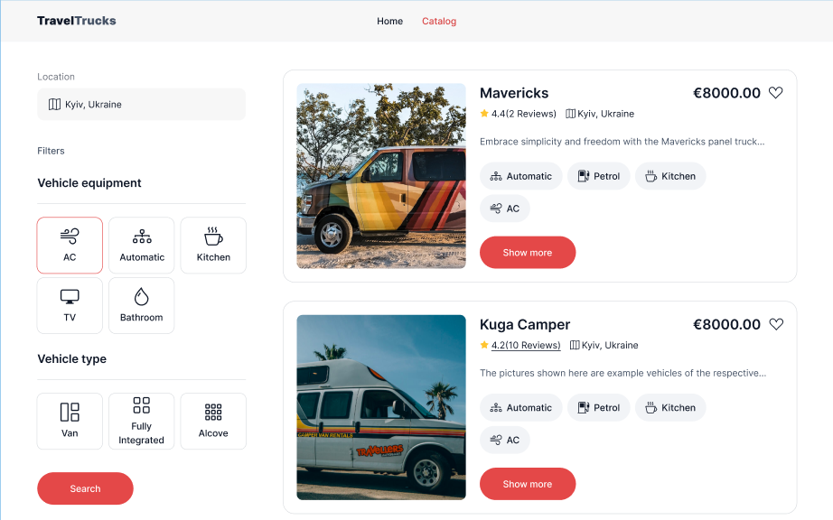
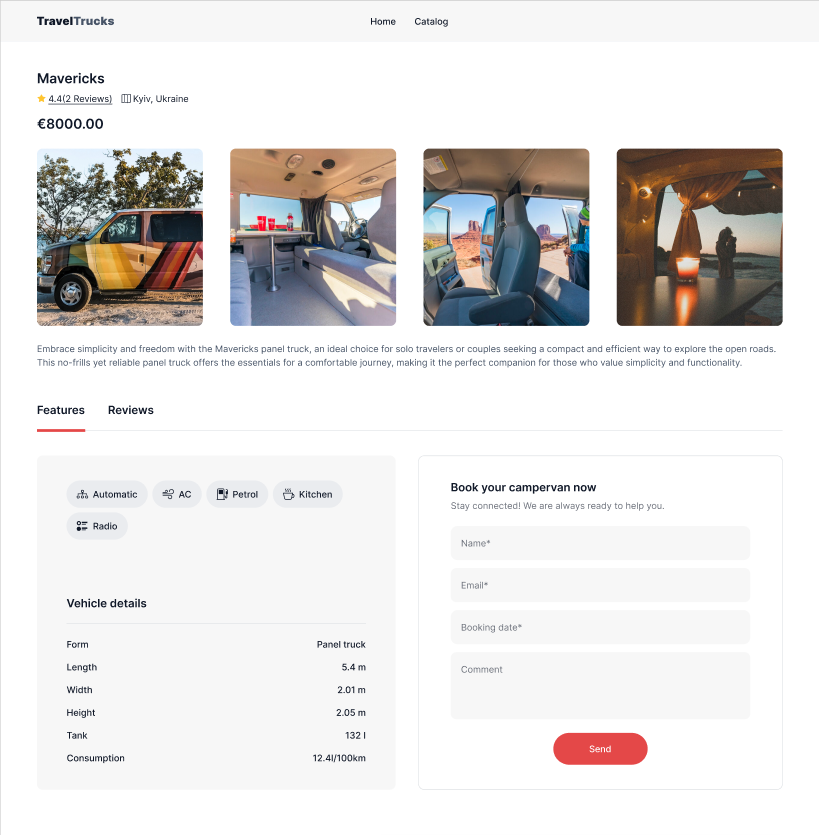
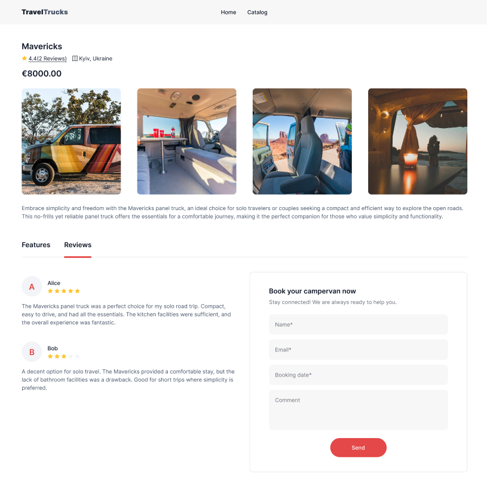

# 🚐 Camper Rental Platform

 💼 Project Overview
The Camper Rental Platform is built with modern tools to ensure the best possible user experience. Our platform makes finding and renting a campervan as easy as a few clicks.

<!-- Replace with an actual image or screenshot -->

Tech Stack
⚡ Vite — lightning-fast development and optimized builds.
⚛️ React — for building dynamic user interfaces.
🌍 React Router — to manage navigation across pages.
🎯 Redux Toolkit — centralized state management for better performance and scalability.
🛠️ React Hook Form & Yup — simple and powerful form validation.
📅 React Datepicker — intuitive date selection for bookings.
🖌️ CSS Modules — scoped styling for better maintainability.
🎯 How to Use
Browse Campers: Use our filters to search for campervans by location, ratings, and available dates.
Check Availability: View real-time availability and make your reservation with just a few clicks.
Book Your Camper: Choose your preferred camper, select booking dates, and confirm the rental.
Review & Rate: After your adventure, leave a review and share your experience with other users.
📷 Screenshot






👤 Author
Developed by Serhii Hudzenko

Email: gudzsvmail@gmail.com
GitHub: Serhii Hudzenko
Feel free to reach out for any questions or collaboration opportunities!

📝 License
This project is licensed under the MIT License

## 🚀 Quick Start

### Installation

Clone the repository to get started:

```bash
git clone https://github.com/gudzsv/travel-trucks.git
cd camper-rental-platform
```

Install the dependencies:

```bash
npm install
# or
yarn install
```
Run the development server:
```bash
npm run dev
# or
yarn dev
```
Build for production:
```bash
npm run build
# or
yarn build
```
